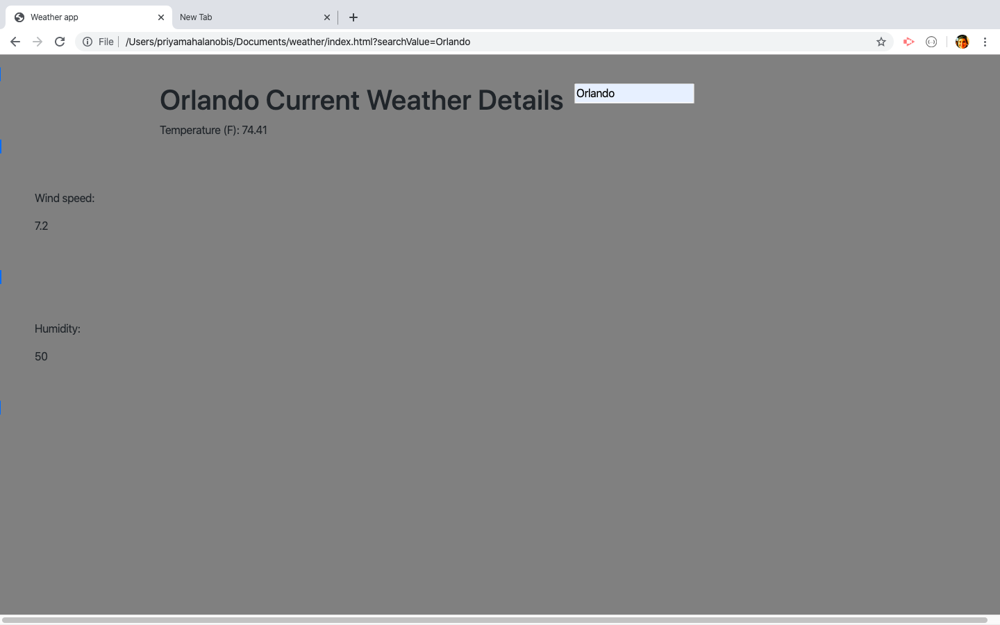
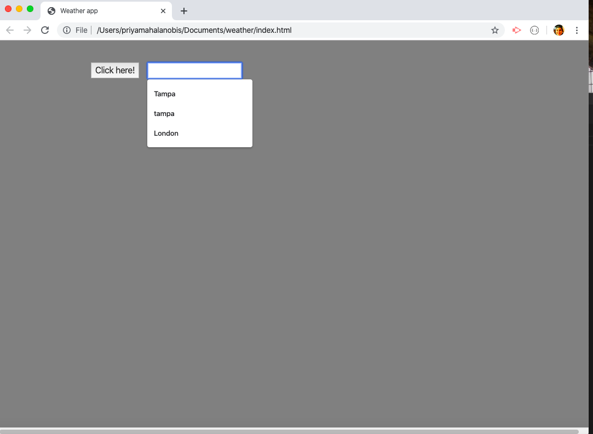

# Weather Dashboard

### GH Pages URL:  https://pmahalan.github.io/weather/

The purpose of my creating the weather dashboard is to utlize APIs, and to practice using jQuery methods such as .ajax. With the successful retrival of information from weather APIs, (and with proper coding to display that information), the weather dashboard should display the temperature, humidity, wind speed, UV index, and a five-day forecast of any given city that the user searches for.

For the values of temperature, wind speed and humidity, I was able to rely on the 'Open Weather Map' API. I designed my code so that when the user types the name of a place into a search field, the clicking of the search button makes a request to the API and retrieves information for the place typed in by the user.

Because Open Weather Map does not provide 5-day forecasts or UV index information, I needed to get those aspects from a second API (Dark Sky API). However, unfortunatley, Dark Sky API gets weather information based on a place's latitude and longitude coodinates rather than the name. Because of this, I need to create a function that retrieves a place's latitude and longitude coordinates upon the user's typing in and searching for the name of the place. (Then, these coordinates can be entered into the URL for the API request.)

